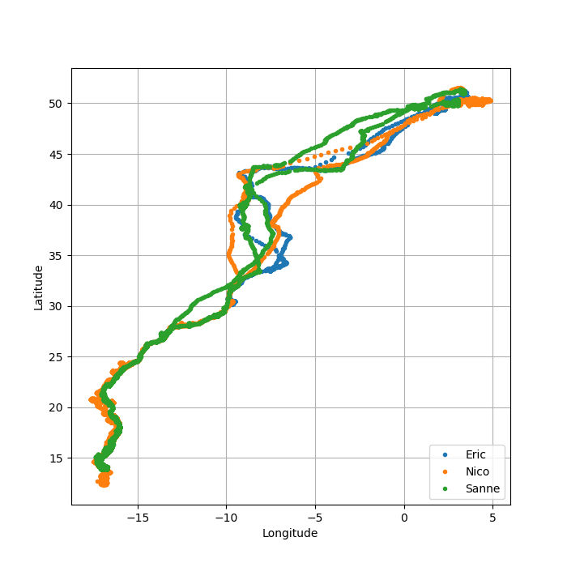
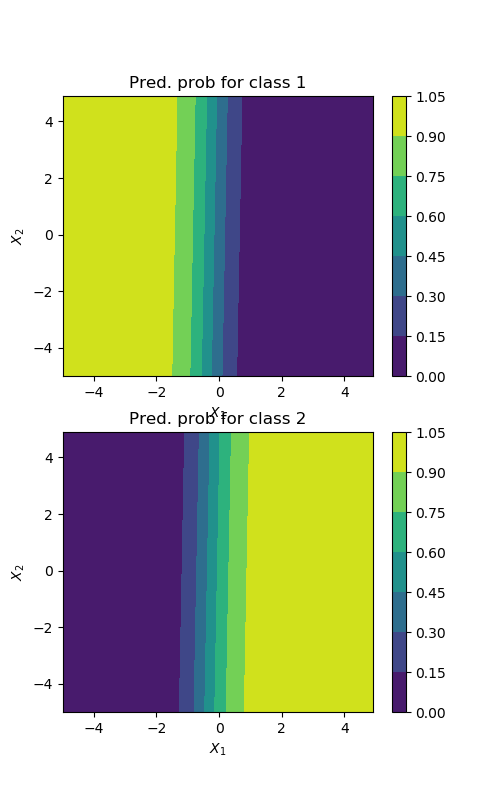
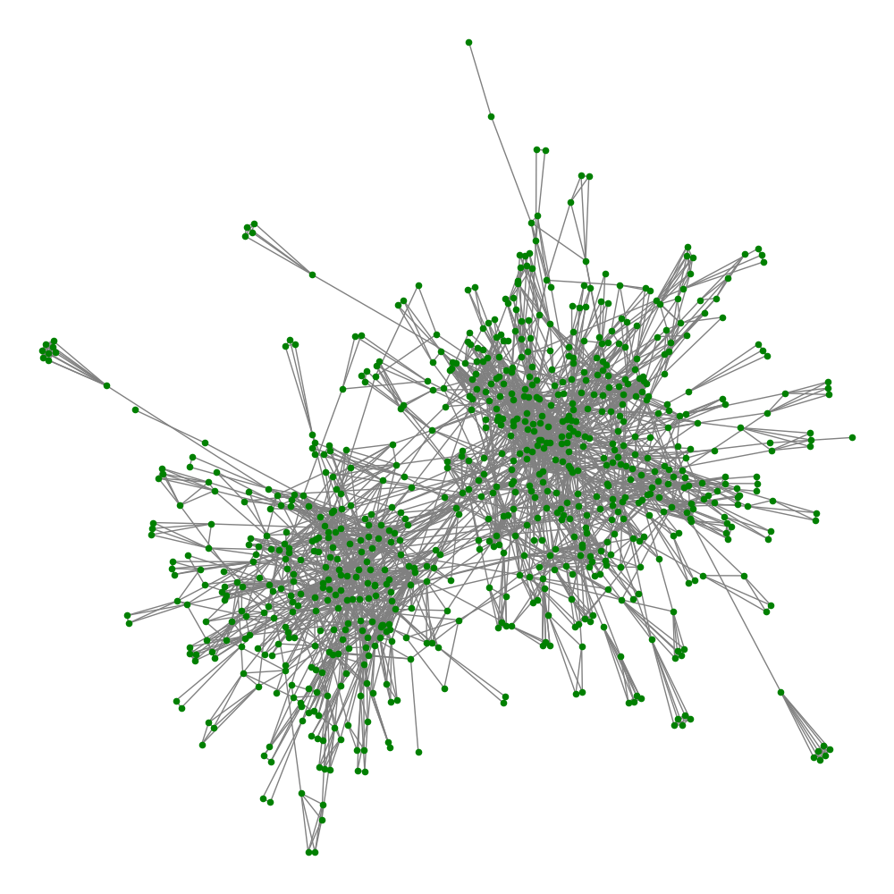

# pyplotting-data
Some data processing examples using Python

Each of these scripts obtains some kind of data (from a file or just random) and represents it in different ways making use of matplotlib functions. Some examples:

* A bird flying course
 

* Logistic regression for data classification
 

* A network map of a village
 
